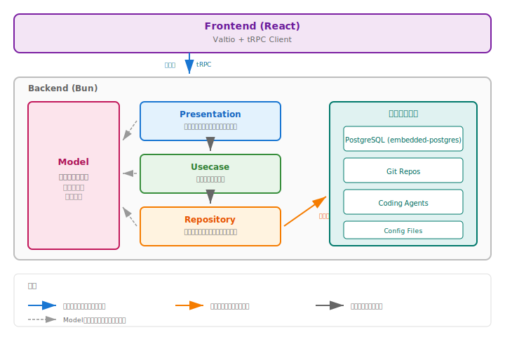
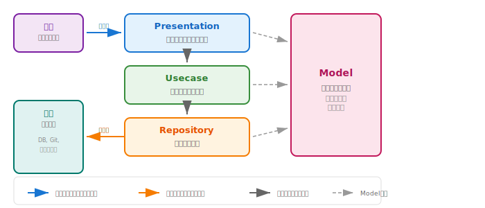

# システムアーキテクチャ

## レイヤードアーキテクチャ概要



## レイヤー詳細

### Model Layer

全レイヤーに共通のドメイン言語を提供する最下層。依存関係を持たない。

```typescript
// models/task.ts
export type TaskStatus = 'todo' | 'inprogress' | 'inreview' | 'done' | 'cancelled';

export interface Task {
  id: string;
  projectId: string;
  title: string;
  description: string | null;
  status: TaskStatus;
  createdAt: Date;
  updatedAt: Date;
}

// 値オブジェクト
export interface TaskId {
  readonly value: string;
}

// ファクトリ関数
export function createTask(params: {
  projectId: string;
  title: string;
  description?: string;
}): Omit<Task, 'id' | 'createdAt' | 'updatedAt'> {
  return {
    projectId: params.projectId,
    title: params.title,
    description: params.description ?? null,
    status: 'todo',
  };
}
```

### Repository Layer

**能動的な外部とのやり取り**を担当。アプリケーションから外部システム（DB、Git、コマンド実行等）へ能動的に呼び出す。Specification Patternとページネーションをサポート。

```typescript
// repositories/task-repository.ts
import type { Task } from '../models/task';
import type { Comp, Cursor, Page } from '../models/common';

// DBアクセスRepositoryの標準メソッド
export interface TaskRepository {
  get(spec: Comp<Task.Spec>): Task | null;
  list(spec: Comp<Task.Spec>, cursor: Cursor<Task.SortKey>): Page<Task>;
  upsert(task: Task): void;
  delete(spec: Comp<Task.Spec>): void;
  count(spec: Comp<Task.Spec>): number;
}

// 使用例
// taskRepo.get(Task.ById('task-123'))
// taskRepo.list(and(Task.ByProject('proj-1'), Task.ByStatuses('todo')), cursor)
// taskRepo.delete(Task.ById('task-123'))

// Task.SortKeyはModel層で定義されたソート可能フィールド
// Task.cursor(task, sortKeys)でカーソル位置を取得
```

### Usecase Layer

ビジネスロジックを実行。1ユースケース = 1トランザクションの単位。

**ステップベースの設計**: 全usecaseは`pre → read → process → write → post → result`の6ステップで構成。全ステップは非同期（`Promise<T>`を返す）。`pre`は`(ctx) => Promise<state>`、他は`(ctx, state) => Promise<newState>`のシグネチャを持ち、**全ステップ省略可能**（自動的にidentity関数が適用）。引数はクロージャ経由で渡す。

```typescript
// usecases/task/list-tasks.ts - 最もシンプルなパターン
export const listTasks = (projectId: string) => usecase({
  read: async (ctx, _) => await ctx.repos.task.list(Task.ByProject(projectId)),
  // result省略 → readの戻り値がそのまま結果になる
});

// usecases/task/create-task.ts - fail() でエラーを返すパターン
export const createTask = (task: Task) => usecase({
  read: async (ctx, _) => {
    const project = await ctx.repos.project.get(Project.ById(task.projectId));
    if (!project) return fail('NOT_FOUND', 'Project not found');
    return { project };
  },
  write: async (ctx, state) => {
    // state は { project: Project }（Fail は自動除外）
    await ctx.repos.task.upsert(task);
    return state;
  },
  result: async () => task,
});
```

**1 usecase = 1 transaction**: `read → process → write`はトランザクション内で実行され、一貫性が保証される。

**usecase間呼び出し禁止**: usecase内から別のusecaseを呼び出してはならない。共通処理が必要な場合はModelにメソッドを追加する。

**実行フロー**:
```
(引数) ─closure─→ pre ─→ preState ─read─→ readState ─process─→ processState ─write─→ writeState ─post─→ postState ─result─→ output
                   ↑                  └────────────────────────────────────────────┘                  ↑           ↑
                 省略可                               トランザクション内                              省略可      省略可
                   └──────────────────────────────────────────────────────────────────────────────────┘        (=postState)
                                                   トランザクション外
```

**returnベースエラー**: 各ステップで`fail('CODE', 'message')`を返すと、後続ステップはスキップされ、Presentation層に`Result<T, Fail>`として返る。

### Presentation Layer

**受動的な外部とのやり取り**を担当。外部（Frontend等）からのリクエストを受け付け、応答を返す。入力検証、外部型→Model型変換、usecaseランナー呼び出しを担当。

```typescript
// presentation/routers/task.ts
import { z } from 'zod';
import { router, publicProcedure } from '../trpc';
import { createTask } from '../../usecases/task/create-task';

export const taskRouter = router({
  create: publicProcedure
    .input(z.object({
      projectId: z.string().uuid(),
      title: z.string().min(1).max(200),
      description: z.string().max(10000).optional(),
    }))
    .mutation(({ ctx, input }) =>
      createTask(input).run(ctx)
    ),
});
```

## パッケージ構成

```
server/
├── src/
│   ├── index.ts           # エントリーポイント
│   │
│   ├── presentation/      # Presentation Layer（受動的な外部受信）
│   │   ├── trpc.ts            # tRPC設定
│   │   ├── context.ts         # コンテキスト（DI）
│   │   ├── websocket.ts       # WebSocket設定
│   │   └── routers/
│   │       ├── index.ts       # appRouter
│   │       ├── task.ts
│   │       ├── project.ts
│   │       ├── workspace.ts
│   │       └── config.ts
│   │
│   ├── usecases/          # Usecase Layer
│   │   ├── task/
│   │   │   ├── create-task.ts
│   │   │   ├── update-task.ts
│   │   │   └── list-tasks.ts
│   │   ├── workspace/
│   │   │   ├── create-workspace.ts
│   │   │   └── start-session.ts
│   │   └── executor/
│   │       └── run-agent.ts
│   │
│   ├── repositories/      # Repository Layer（能動的な外部呼び出し）
│   │   ├── common.ts           # compToSQL共通関数
│   │   ├── sql.ts              # SQL構築ユーティリティ
│   │   ├── pagination.ts       # ページネーション（Cursor, Pager, Page）
│   │   ├── task-repository.ts
│   │   ├── project-repository.ts
│   │   ├── workspace-repository.ts
│   │   ├── git-repository.ts   # 外部: Git操作
│   │   ├── executor-repository.ts # 外部: エージェント実行
│   │   └── event-repository.ts # 外部: EventEmitter
│   │
│   └── models/            # Model Layer
│       ├── common.ts
│       ├── task.ts
│       ├── project.ts
│       ├── workspace.ts
│       ├── session.ts
│       └── execution-process.ts
│
└── package.json

client/                        # Frontend
├── src/
│   ├── pages/
│   ├── components/
│   ├── store/             # Valtio
│   └── lib/               # tRPCクライアント
└── package.json
```

## 依存関係の方向



**ルール:**
- **青矢印（受動的）**: 外部からPresentationへのリクエスト受信
- **橙矢印（能動的）**: Repositoryから外部システムへの呼び出し
- **実線**: 上位レイヤーは下位レイヤーを呼び出す（Presentation → Usecase → Repository）
- **破線**: 全レイヤーがModelを共通言語として参照
- Model Layerは他のレイヤーに依存しない
- Repository Layerはインターフェースで抽象化（テスト容易性）

**外部とのやり取りの方向性:**
| レイヤー | 方向 | 説明 |
|---------|------|------|
| Presentation | 受動的 | 外部からのリクエストを受信し、応答を返す |
| Repository | 能動的 | 外部システム（DB、Git、コマンド等）を能動的に呼び出す |

## 設計原則: Modelを中心としたデータフロー

**全レイヤー間のデータ受け渡しはModel型で行う。各レイヤーが独自のデータ構造を定義してはならない。**

### Presentation Layer の責務

- 外部からのリクエスト（tRPCのinput）をModel型に変換
- Model型をUsecaseに渡して処理を委譲
- Usecaseから返されたModel型をそのままレスポンスとして返す

```typescript
// presentation/routers/task.ts
export const taskRouter = router({
  create: publicProcedure
    .input(z.object({
      projectId: z.string(),
      title: z.string(),
    }))
    .mutation(({ ctx, input }) => {
      // input（外部型）をModel型に変換してUsecaseに渡す
      const taskInput: CreateTaskInput = {
        projectId: input.projectId,
        title: input.title,
      };
      const usecase = new CreateTaskUsecase(ctx.db);
      // Usecaseから返されるのはTask（Model型）
      return usecase.execute(taskInput);
    }),
});
```

### Repository Layer の責務

- Usecaseから受け取ったModel型をDB/外部サービスに永続化
- DBのレコードや外部サービスのレスポンスを**内部で**Model型に変換
- Usecaseには常にModel型で返す

```typescript
// repositories/task-repository.ts
export class TaskRepository {
  // DBの行をModel型に変換（内部処理）
  private mapRow(row: Record<string, unknown>): Task {
    return {
      id: row.id as string,
      projectId: row.project_id as string,
      title: row.title as string,
      // ... 以下略
    };
  }

  // 標準メソッド: get(spec)
  get(spec: Comp<Task.Spec>): Task | null {
    const where = compToSQL(spec, taskSpecToSQL);
    const row = this.db.queryGet(sql`SELECT * FROM tasks WHERE ${where}`);
    return row ? this.mapRow(row) : null;
  }

  // 標準メソッド: upsert(model)
  upsert(task: Task): void {
    this.db.queryRun(sql`
      INSERT INTO tasks (id, project_id, title, ...) VALUES (...)
      ON CONFLICT(id) DO UPDATE SET ...
    `);
  }
}
```

### Usecase Layer の責務

- Presentationから**Model型で**入力を受け取る（クロージャで参照）
- 6ステップ（pre, read, process, write, post, result）で処理を構成
- **全ステップは非同期**（`Promise<T>`を返す）
- 各ステップは前のステップの状態を受け取り、新しい状態を返す
- **全ステップ省略可能**（自動的にidentity関数が適用）
- result省略時は最後のステップの状態がそのまま結果になる
- **1 usecase = 1 transaction**: read → process → write はトランザクション内で実行
- **usecase間呼び出し禁止**: 共通処理はModelにメソッドとして実装
- **Usecaseが独自のデータ構造（DTO等）を定義してはならない**
- **`let`変数や型アサーション`!`を使わない**

```typescript
// usecases/task/update-status.ts
export const updateTaskStatus = (taskId: string, newStatus: TaskStatus) => usecase({
  read: async (ctx, _) => {
    const task = await ctx.repos.task.get(Task.ById(taskId));
    if (!task) return fail('NOT_FOUND', 'Task not found');
    return { task };
  },
  process: async (ctx, { task }) => {
    // state の型は { task: Task }（Fail 自動除外）
    // ctx.now で現在時刻を参照（usecase呼び出し時点で固定）
    if (!canTransition(task.status, newStatus)) {
      return fail('INVALID_TRANSITION', `Cannot transition`);
    }
    return { ...task, status: newStatus, updatedAt: ctx.now };
  },
  write: async (ctx, task) => {
    await ctx.repos.task.upsert(task);
    return task;
  },
  // result省略 → write の戻り値 (Task) がそのまま結果になる
});
```

### 設計原則のまとめ

```
┌─────────────────────────────────────────────────────────────────┐
│                                                                 │
│   外部 ──(外部型)──▶ Presentation ──(Model)──▶ Usecase          │
│                                        │                        │
│                                        ▼                        │
│                                   Repository                    │
│                                   │        │                    │
│                           (Model) │        │ (DB行/APIレスポンス)│
│                                   ▼        ▼                    │
│                              Usecase   DB/外部サービス          │
│                                   │                             │
│                           (Model) │                             │
│                                   ▼                             │
│   外部 ◀──(Model)─── Presentation ◀──(Model)─── Usecase        │
│                                                                 │
└─────────────────────────────────────────────────────────────────┘

※ Repository内部でのみDB行↔Model変換が発生
※ Usecase, Presentation間は常にModel型でやり取り
※ UsecaseはModelのメソッド/ファクトリを使ってビジネスロジックを実行
```

## tRPCによる型の流れ

```
┌─────────────────────────────────────────────────────────────┐
│                                                             │
│  Backend                           Frontend                 │
│                                                             │
│  presentation/routers/task.ts      pages/Tasks.tsx          │
│  ┌─────────────────┐               ┌─────────────────┐     │
│  │ taskRouter = {  │               │                 │     │
│  │   list: proc    │──── 型推論 ───▶│ trpc.task.list │     │
│  │     .query()    │               │   .useQuery()   │     │
│  │                 │               │                 │     │
│  │   create: proc  │──── 型推論 ───▶│ trpc.task      │     │
│  │     .mutation() │               │   .create      │     │
│  │ }               │               │   .useMutation()│     │
│  └─────────────────┘               └─────────────────┘     │
│                                                             │
│  ※ Model層の型がフロントエンドまで自動伝播                    │
│                                                             │
└─────────────────────────────────────────────────────────────┘
```

## データフロー

### タスク作成の例

```
Frontend                 Presentation              Usecase Runner          Repository
    │                         │                         │                      │
    │ trpc.task.create        │                         │                      │
    │ { title, projectId }    │                         │                      │
    │────────────────────────▶│                         │                      │
    │                         │ Zod validation          │                      │
    │                         │ 外部型→Model変換         │                      │
    │                         │                         │                      │
    │                         │ createTask(input)      │                      │
    │                         │   .run(ctx)            │                      │
    │                         │────────────────────────▶│                      │
    │                         │                         │ pre (省略)           │
    │                         │                         │ ─── transaction ───  │
    │                         │                         │ await read: project  │
    │                         │                         │─────────────────────▶│
    │                         │                         │◀─────────────────────│
    │                         │                         │ await process (省略) │
    │                         │                         │ await write: task    │
    │                         │                         │─────────────────────▶│
    │                         │                         │                      │ INSERT INTO
    │                         │                         │                      │─────▶ PostgreSQL
    │                         │                         │◀─────────────────────│
    │                         │                         │ ─── end tx ───       │
    │                         │                         │ post (省略)          │
    │                         │                         │ result: Task返却     │
    │                         │◀────────────────────────│                      │
    │◀────────────────────────│                         │                      │
    │ Result<Task, Error>     │                         │                      │
```

**1 usecase = 1 transaction**: read → process → write の3ステップは単一トランザクション内で実行され、原子性が保証される。

### リスト取得（カーソルベースページネーション）

```
Frontend                 Presentation           Usecase              Repository
    │                         │                    │                     │
    │ trpc.task.list          │                    │                     │
    │ { projectId,            │                    │                     │
    │   cursor: { limit: 20 }}│                    │                     │
    │────────────────────────▶│                    │                     │
    │                         │ ListTasksUsecase   │                     │
    │                         │───────────────────▶│                     │
    │                         │                    │ Specification構築   │
    │                         │                    │                     │
    │                         │                    │ taskRepo.list()     │
    │                         │                    │────────────────────▶│
    │                         │                    │                     │ SELECT (limit+1)
    │                         │                    │                     │─────▶ PostgreSQL
    │                         │                    │◀────────────────────│
    │                         │◀───────────────────│                     │
    │◀────────────────────────│                    │                     │
    │ Page<Task>      │                    │                     │
    │ { items, nextCursor,    │                    │                     │
    │   hasMore }             │                    │                     │
```

## コンテキストとDI

```typescript
// presentation/context.ts
import { PgDatabase } from '../db/pg-client';
import { TaskRepositoryImpl } from '../repositories/task-repository';
import { ProjectRepositoryImpl } from '../repositories/project-repository';

export function createContext() {
  const db = new PgDatabase();

  return {
    db,
    taskRepo: new TaskRepositoryImpl(db),
    projectRepo: new ProjectRepositoryImpl(db),
    // ... 他のリポジトリ
  };
}

export type Context = ReturnType<typeof createContext>;
```

## 状態管理の役割分担

```
┌─────────────────────────────────────────────────────────────┐
│                     Frontend State                          │
├─────────────────────────────────────────────────────────────┤
│                                                             │
│  ┌─────────────────────┐    ┌─────────────────────┐        │
│  │   tRPC + React Query │    │       Valtio        │        │
│  │                     │    │                     │        │
│  │  - サーバーデータ     │    │  - UIローカル状態    │        │
│  │  - キャッシュ        │    │  - フィルター       │        │
│  │  - 同期状態         │    │  - 選択状態         │        │
│  │  - リアルタイム更新   │    │  - 一時的な入力     │        │
│  │                     │    │                     │        │
│  └─────────────────────┘    └─────────────────────┘        │
│                                                             │
└─────────────────────────────────────────────────────────────┘
```

## ビルドとデプロイ

### 開発時

```
┌─────────────────┐     ┌─────────────────┐
│   Vite Dev      │     │   Bun Server    │
│   (port 5173)   │────▶│   (port 3000)   │
│                 │proxy│                 │
└─────────────────┘     └─────────────────┘
```

### 本番ビルド

```
┌─────────────────────────────────────────┐
│           bun build --compile           │
├─────────────────────────────────────────┤
│                                         │
│  server/src/index.ts                    │
│            +                            │
│  client/dist/ (静的ファイル)             │
│            ↓                            │
│  dist/auto-kanban (シングルバイナリ)     │
│                                         │
└─────────────────────────────────────────┘
```

## セキュリティ考慮事項

| 項目 | 対応 |
|------|------|
| CORS | Hono middlewareで設定 |
| 入力検証 | Zodスキーマで検証（Presentation Layer） |
| SQLインジェクション | パラメータバインディングで防止 |
| 認証 | 個人利用のため省略可（必要なら追加） |
