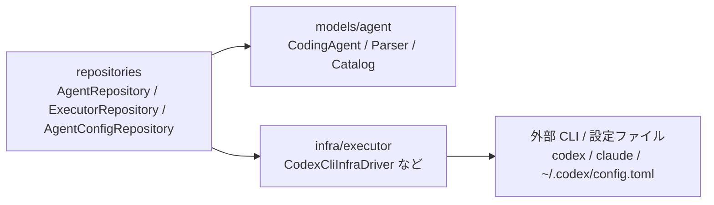

## 関連ファイル

- `server/src/models/agent/agent.ts`
- `server/src/models/agent/catalog.ts`
- `server/src/models/agent/claude-code.ts`
- `server/src/models/agent/codex-cli.ts`
- `server/src/models/agent/gemini-cli.ts`
- `server/src/models/agent/parser.ts`
- `server/src/repositories/agent/`
- `server/src/infra/executor/`
- `server/src/repositories/executor/drivers/`
- `server/src/usecases/setup/seed-variants.ts`
- `server/src/usecases/execution/get-structured-logs.ts`
- `server/src/usecases/execution/get-structured-log-delta.ts`

## 機能概要

**Agent は、AutoKanban が扱える外部 Coding Agent の種類を表す model オブジェクト**である。
Claude Code / Gemini CLI / Codex CLI のような実行主体ごとに、表示名、既定コマンド、
インストール案内、機能 capability、初期 Variant、ログ parser を定義する。

Agent は「外部プロセスをどう spawn するか」ではなく、「この種類の agent は AutoKanban
ドメイン上でどういう意味を持つか」を表す。実際の subprocess、設定ファイル、protocol I/O は
infra / repository 側に置き、Agent model はそれらを import しない。

## 概念的背景: なぜ executor 文字列ではなく Agent model にするのか

以前は `Session.executor` や `Variant.executor` の `"claude-code"` / `"gemini-cli"` という文字列を
各所で直接扱い、executor ごとの違いを driver や usecase 側の分岐で吸収していた。
これは executor が 1〜2 種類のうちは成立するが、Codex CLI を追加すると以下の差異が表面化する。

| 観点 | Claude Code | Gemini CLI | Codex CLI |
|---|---|---|---|
| 起動方式 | protocol mode | headless one-shot | `codex exec --json` one-shot |
| resume | `--resume` + message id | なし | `codex exec resume` |
| approval | control protocol で応答可能 | headless では非対応 | CLI exec では AutoKanban からの応答は未対応 |
| ログ形式 | Claude JSON protocol | stream-json / text | JSONL event |
| MCP 設定 | `~/.claude.json` | agent 依存 | `~/.codex/config.toml` |

これらを usecase に `if executor === "codex-cli"` として埋め込むと、
新しい agent を追加するたびに start / follow-up / log-stream / settings の全層が膨らむ。
Agent model は、executor 種別に関する**ドメイン上の定義**を 1 箇所に集めるための境界である。

## レイヤー境界

Agent 対応は、以下の依存方向を守る。

- `models/agent` は infra を知らない
- `infra/executor` は `CodingAgent` などの model を知らない
- `repositories` は model と infra の両方を知り、agent id をキーに結びつける
- usecase は repository を通じて Agent の parser や executor driver を使う

この構造により、Agent はドメイン定義として純粋に保ち、外部ツール固有の spawn / file I/O は
infra に閉じ込められる。

## 主要メンバー

`CodingAgent` は以下を持つ。

- `id` — `"claude-code"`, `"gemini-cli"`, `"codex-cli"` など。`Session.executor` / `Variant.executor`
  と同じ識別子
- `displayName` — UI 表示名
- `defaultCommand` — agent command 未設定時の既定 CLI 名
- `installHint` — 起動時 availability check や設定 UI で使う導入ヒント
- `capabilities` — agent が持つ能力
- `defaultVariants` — 初回 seed される Variant 群
- `createParser()` — raw log を `ConversationEntry[]` に変換する純粋 parser

capability は usecase の分岐条件ではなく、agent の能力を表す model 情報として使う。
代表例:

| Capability | 意味 |
|---|---|
| `protocolSession` | 実行中プロセスに protocol message を送れる |
| `oneShot` | 1 prompt = 1 process の headless 実行 |
| `resume` | 過去 session を後続 process から継続できる |
| `streamJsonLogs` | stdout が構造化 event として流れる |
| `approvalRequest` | AutoKanban の ApprovalCard から応答可能 |
| `mcpConfig` | AutoKanban が agent の MCP 設定を管理できる |
| `structuredOutput` | JSON schema 付き one-shot 出力が使える |

## Parser の位置づけ

`AgentLogParser` は `parse(rawLogs: string) -> ParseResult` を満たす model object である。
DB、filesystem、subprocess、logger に触らず、同じ raw log から同じ `ConversationEntry[]` と
`isIdle` を返す純粋計算として定義する。

この設計により:

- Claude JSON protocol parser と Codex JSONL parser を同じ UI 契約へ変換できる
- parser は単体テストだけで検証できる
- SSE snapshot / delta は executor 固有形式を知らず、`AgentRepository.getParser()` だけを呼べばよい
- Codex CLI から将来 Codex app-server に移行しても、別 parser を Agent 定義に差し替えやすい

`ConversationEntry` は UI の共通 read model であり、Agent 固有 event をそのまま漏らさない。
たとえば Codex の `exec_command_begin` / `exec_command_end` は `tool` entry の command action に、
Claude の `tool_use` / `tool_result` も同じ `tool` entry に写像される。

## repository と infra の結合

repository は Agent model と infra 実装を結合する。

- `AgentRepository` は `AgentCatalog` を公開し、parser を生成する
- `ExecutorRepository` は agent id から `ICodingAgentDriver` を選ぶ
- `CodexCliDriver` は repository 層の driver adapter で、model 非依存の `CodexCliInfraDriver` を使って
  subprocess を起動する
- `AgentConfigRepository` は agent id ごとの設定ファイル形式差を吸収する

この分離で、infra 側の `CodexCliInfraDriver` は `CodingAgent` を import しない。
`CodexCliInfraDriver` は単に `codex exec --json` を spawn できる低レベル adapter であり、
それが AutoKanban のどの Agent に対応するかは repository 側が決める。

## 初期 Agent

### Claude Code

- `id: "claude-code"`
- 既定 command: `claude`
- capability: `protocolSession`, `approvalRequest`, `mcpConfig`, `structuredOutput`
- default variants: `DEFAULT`, `BYPASS`, `PLAN`
- parser: 既存 Claude JSON protocol parser

Claude Code は AutoKanban で最も深く統合されている agent で、ExitPlanMode approval、
permission response、session/message id による resume を扱う。

### Gemini CLI

- `id: "gemini-cli"`
- 既定 command: `gemini`
- capability: `oneShot`, `streamJsonLogs`
- default variants: `DEFAULT`
- parser: plain/stream log parser

Gemini CLI は headless 実行として扱う。approval や protocol session は現在の対象外。

### Codex CLI

- `id: "codex-cli"`
- 既定 command: `codex`
- capability: `oneShot`, `resume`, `streamJsonLogs`, `mcpConfig`
- default variants: `DEFAULT`, `READONLY`, `YOLO`
- parser: Codex JSONL event parser

Codex CLI は MVP として `codex exec --json --cd <worktree> -` で起動する。
`permissionMode` は repository/infra 側で CLI flag に変換される。

| Variant | Codex CLI 起動方針 |
|---|---|
| `DEFAULT` (`full-auto`) | `--full-auto` |
| `READONLY` (`read-only`) | `--sandbox read-only` |
| `YOLO` (`dangerously-bypass`) | `--dangerously-bypass-approvals-and-sandbox` |

Codex CLI exec mode では AutoKanban の ApprovalCard から個別 approval に応答する protocol はまだ持たない。
そのため `approvalRequest` capability は付けず、承認連携が必要になった場合は Codex app-server / SDK
driver を別 Agent もしくは別 Driver として追加する。

## シナリオ

### structured log の parser 選択

1. `getStructuredLogs(executionProcessId)` が `CodingAgentProcess` を取得する
2. process の `sessionId` から `Session.executor` を読む
3. `AgentRepository.getParser(session.executor)` が該当 Agent の parser を生成する
4. parser が raw log を `ConversationEntry[]` に変換する
5. UI は executor 固有形式ではなく共通 `ConversationEntry` を描画する

### 初回 variant seed

1. startup が `seedDefaultVariants()` を呼ぶ
2. `AgentRepository.list()` で Agent catalog を読む
3. 各 Agent の `defaultVariants` を `variants` table に upsert する
4. 既存 variant は上書きせず、ユーザー設定を保つ

### Codex CLI 起動

1. ユーザーが StartAgentDialog で executor `codex-cli` を選ぶ
2. `startExecution` が `Session.executor = "codex-cli"` の Session を作る
3. `ExecutorRepository` が `CodexCliDriver` を選ぶ
4. `CodexCliDriver` が `CodexCliInfraDriver` に spawn を委譲する
5. infra driver は `codex exec --json --cd <worktree> -` を起動し、prompt を stdin で受け取る
6. stdout/stderr は callback 経由で永続 log に保存される
7. structured log stream は `CodexCliLogParser` で JSONL event を会話表示へ変換する

## 失敗 / 例外

- 未知の agent id — `AgentCatalog.require()` が例外を投げ、呼び出し元では internal error になる。
  UI から選べる executor は catalog / variants により制限されるため、通常は発生しない
- parser が未知 event を受け取る — 無視する。raw log は保存されているため Raw Logs ビューでは確認できる
- Codex CLI の approval request — exec mode では応答しない。approval が必要な統合は app-server / SDK
  driver の追加で扱う
- agent の設定ファイル形式が未対応 — `AgentConfigRepository` に adapter を追加する

