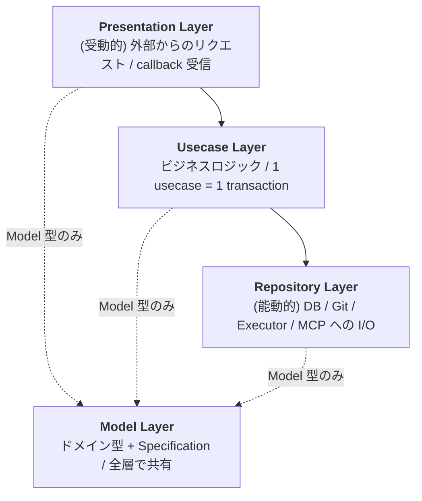

## 関連ファイル

- `server/src/models/` (Model 層)
- `server/src/repositories/` (Repository 層)
- `server/src/usecases/` (Usecase 層)
- `server/src/presentation/` (Presentation 層: tRPC / callback / sse / mcp)
- `.claude/rules/server-patterns.md` (実装時の具体ルール)

## 機能概要

サーバー側は **4 層のレイヤードアーキテクチャ**で分割される:

**層間データは Model 型のみで流し、独自 DTO は禁止**。これが認知負荷を最小化する最大の規約。

## 設計意図

- **4 層に絞った理由**: Clean Architecture のような 5-6 層は個人開発では過剰。
  Presentation / Usecase / Repository / Model の 4 層は「入口 / 業務 / 外部 I/O / 言語」という
  自然な境界に対応し、説明しやすい
- **依存方向を単純化**: 上位層は下位層のみ呼ぶ。Model 層は他のどれにも依存しない。
  この 1 ルールだけで循環依存が生じない
- **Presentation=受動 / Repository=能動**: 外部との関係を方向で二分する。
  受動（HTTP 受信）は Presentation に、能動（DB クエリ / Git 呼び出し）は Repository に集約。
  Usecase は中央で両方を動詞で指揮する
- **Usecase 間の相互呼び出しを禁止**: トランザクション境界が曖昧になるため、共通処理は
  Model のメソッドとして切り出す。Usecase は「1 トランザクション」の単位を守る

## 検討された代替案

- **Clean Architecture**: DIP とドメインの独立性は強いが、UseCase / Interface Adapters /
  Frameworks & Drivers と層が増えて、個人開発では boilerplate だけが残る
- **Hexagonal (Ports & Adapters)**: 外部依存の差し替えやすさは魅力だが、Port を抽象化する
  interface の定義コストに対して、AutoKanban は「差し替える候補（別 DB、別 Executor）」が
  実質無い
- **フラット（層なし）**: 小さなアプリでは楽だが、AutoKanban は 13 エンティティ × 数十
  ユースケースの規模なので層分離のほうが保守しやすい

## 主要メンバー

| 層 | 役割 | 代表ファイル |
|---|---|---|
| Model | ドメイン型 / Specification / ファクトリ | `models/task/index.ts` |
| Repository | DB + External I/O (Git / Executor 等) | `repositories/task/`, `repositories/worktree/` |
| Usecase | 6 ステップのビジネスロジック | `usecases/task/create-task.ts` |
| Presentation | tRPC routers / SSE / Callback / MCP | `presentation/trpc/routers/task.ts` |

### 層間データの流れ

外部型 → Presentation で Model に変換 → Usecase → Repository が DB 行 ↔ Model を内部変換
→ Usecase → Presentation → 外部（Model のまま）。

## 関連する動作

- [usecase_is_executed_in_6_steps](./usecase_is_executed_in_6_steps.md) — Usecase 層の具体的な構造
- [specification_pattern_composes_db_filters](./specification_pattern_composes_db_filters.md) — Model と Repository を繋ぐパターン
- [raw_sql_is_used_instead_of_orm](./raw_sql_is_used_instead_of_orm.md) — Repository 層のスタイル
- [trpc_is_the_client_server_protocol](./trpc_is_the_client_server_protocol.md) — Presentation 層の主要プロトコル
