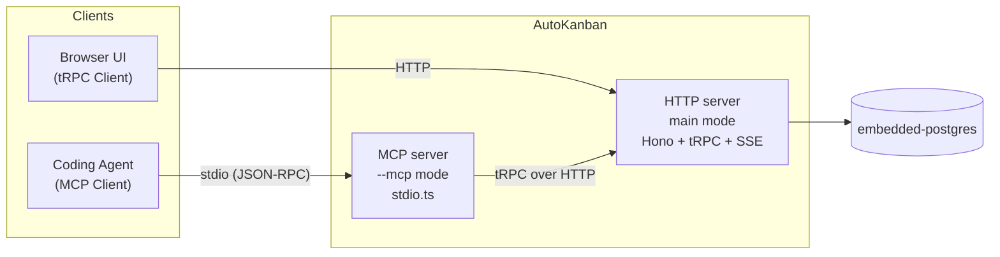

## 関連ファイル

- `server/src/index.ts` (`--mcp` フラグ分岐)
- `server/src/presentation/mcp/stdio.ts` (`runMcpServer`)
- `server/src/presentation/mcp/routers/tools.ts` (ツール定義)
- `server/src/presentation/mcp/auto-kanban.schema.json` (JSON Schema resource)
- `server/src/infra/port-file/index.ts` (`getBaseUrl` で HTTP サーバーの URL 解決)
- `server/src/infra/trpc/client.ts` (`TrpcHttpClient`)

## 機能概要

AutoKanban サーバーは **2 種類のモード**で起動する。起動モードは `process.argv` に
`--mcp` が含まれるかどうかで分岐する（`server/src/index.ts`）:

| モード | 起動方法 | 通信 | 想定利用者 |
|---|---|---|---|
| HTTP (default) | `./auto-kanban` | tRPC over HTTP + SSE + WebSocket | ブラウザ UI |
| MCP | `./auto-kanban --mcp` | **JSON-RPC over stdio** | Coding Agent (Claude Code 等) |

`--mcp` モードでは HTTP サーバーは起動しない。標準入出力を占有する MCP server だけが
動き、**既に別プロセスで起動済みの HTTP サーバーへ内部で tRPC HTTP 呼び出し**を行う。

### HTTP サーバー URL の解決

`server/src/infra/port-file/index.ts` の `getBaseUrl()` が以下の優先順位で決定する:

1. 環境変数 `AUTO_KANBAN_URL`
2. port file `~/.auto-kanban/auto-kanban.port`（HTTP サーバー起動時に書き込み）
3. フォールバック `http://localhost:3000`

HTTP サーバー → MCP サーバー起動の順で立ち上がる。Claude Code が MCP server を spawn する
タイミングで port file は既に存在している。

### 提供される MCP ツール (`presentation/mcp/routers/tools.ts`)

| ツール | 呼び出し先 tRPC | 用途 |
|---|---|---|
| `list_projects` | `project.list` | プロジェクト一覧 |
| `list_tasks` | `task.list` | タスク一覧（project_id 必須） |
| `create_task` | `task.create` | 新規タスク作成 |
| `get_task` | `task.get` | タスク詳細 |
| `update_task` | `task.update` | タスク更新 |
| `delete_task` | `task.delete` | タスク削除 |
| `start_workspace_session` | `execution.start` | Workspace + Agent 起動 |
| `get_context` | (自動解決) | MCP 起動時 cwd を worktree path として逆引き |

パラメータ名は MCP 側 snake_case、tRPC 側 camelCase。`TrpcHttpClient` が変換して中継する。

### 提供される MCP リソース

| URI | 内容 |
|---|---|
| `auto-kanban://schema` | `auto-kanban.json` の JSON Schema（`server/src/presentation/mcp/auto-kanban.schema.json`） |

Agent はこれを参照して `auto-kanban.json` の prepare / server / cleanup を安全に書ける。

## 設計意図

- **1 バイナリ 2 モード**: HTTP と MCP を別バイナリにすると、Claude Code の設定側で両方を
  管理させる必要が出る。同じ binary に `--mcp` フラグで切り替えさせることで、
  ユーザーは `auto-kanban` 1 つだけを知っていればよい
- **HTTP サーバーへの tRPC 中継**: MCP ツールからビジネスロジックを再実装すると二重メンテに
  なる。MCP server は **薄い透過プロキシ**として HTTP サーバーの tRPC を呼ぶ設計で、
  真実のソースは常に Usecase 層に閉じる
- **port file + 環境変数の優先順位**: 通常運用は port file で自動解決、開発時は
  `AUTO_KANBAN_URL=http://localhost:3001 ./auto-kanban --mcp` で上書きできる
- **stdio を占有する**: MCP は親 Process（Agent）が stdin を閉じるまでブロック。これが
  自然な寿命管理になる（Agent が死んだら MCP も死ぬ）
- **MCP instructions の文言**: `Server` コンストラクタの `instructions` に `list_projects` /
  `list_tasks` などの使い方を直書きし、Agent が systemPrompt 相当として受け取る

## 主要メンバー

- `process.argv.includes("--mcp")` — エントリの分岐点
- `runMcpServer()` — MCP モードのエントリ関数（`presentation/mcp/stdio.ts`）
- `getBaseUrl()` — HTTP サーバー URL の解決（`infra/port-file/`）
- `TrpcHttpClient` — tRPC HTTP 呼び出しクライアント（`infra/trpc/client.ts`）
- `registerMcpTools(server, client)` — ツール登録
- `ListResourcesRequestSchema` / `ReadResourceRequestSchema` — `@modelcontextprotocol/sdk` の
  ハンドラ登録

## 関連する動作

- [mcp_injection_is_the_agent_context_bridge](../mcp-config/mcp_injection_is_the_agent_context_bridge.md) — MCP を自己注入する理由
- [auto_kanban_is_injected_as_mcp_server](../mcp-config/auto_kanban_is_injected_as_mcp_server.md) — Agent 設定ファイルへの書き込み
- [workspace_config_is_auto_kanban_json](./workspace_config_is_auto_kanban_json.md) — `auto-kanban://schema` resource の対象
- [trpc_is_the_client_server_protocol](./trpc_is_the_client_server_protocol.md) — 中継先の tRPC API
