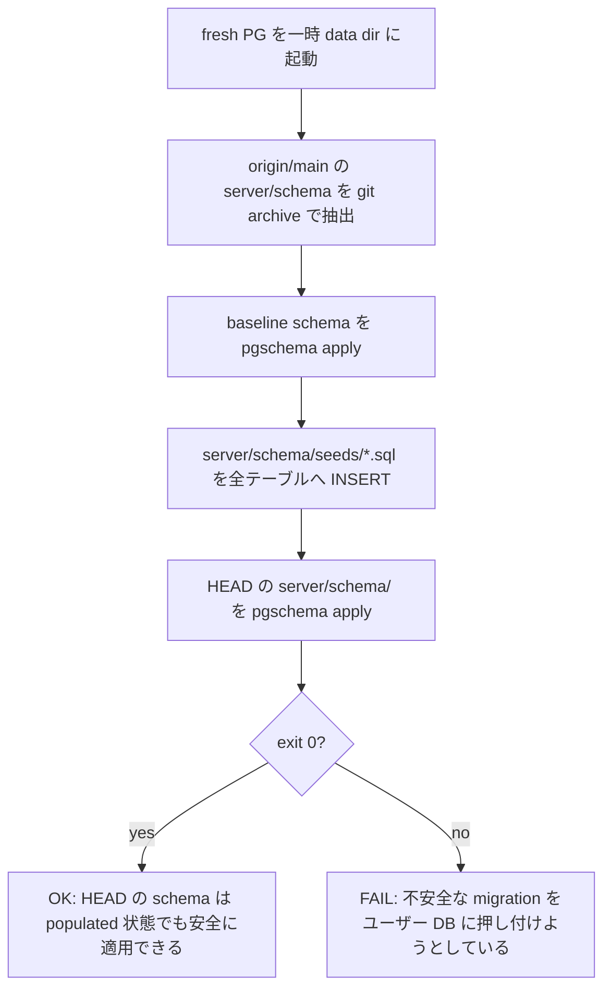

## 関連ファイル

- `server/schema/schema.sql` (single source of truth)
- `server/schema/tables/*.sql` (テーブル定義)
- `server/schema/seeds/*.sql` (テーブルごとの最小 seed SQL)
- `server/src/infra/db/pgschema.ts` (`ensurePgSchema` — 起動時に差分適用)
- `server/scripts/check-schema-upgrade.ts` (このルールを CI で強制するテスト)
- `server/package.json` (`check:schema-upgrade` スクリプト)

## 機能概要

`server/schema/` の変更は **既存データを抱えたユーザーの DB に対して安全に適用できなければならない**。
具体的には、起動時の `ensurePgSchema` が pgschema 経由で発行する DDL が、ユーザーの既存行に対して
失敗してはならない。これは `bun run check:schema-upgrade` が CI で機械的に検証する。

検査の流れ:

`origin/main` がローカルに無い場合（fresh clone 直後など）は **warn skip** する。CI では `origin/main` が
常に取得済みなのでチェックは必ず走る。

## 設計意図

- **AutoKanban は migration script を書かない**: `server/schema/*.sql` が SSOT で、pgschema が差分を
  declarative に適用する（[`postgresql_is_embedded_for_storage`](./postgresql_is_embedded_for_storage.md)）。
  この方針の代償として、**追加 NOT NULL カラムには DEFAULT が必須**、新 CHECK / UNIQUE / FK 制約は
  既存データが従っていなければ適用できない、といった「populated DB でだけ壊れる」失敗パターンが生まれる
- **既存テストでは検出不能な構造的弱点**: 既存の `check:test` はフレッシュ PG が前提（test isolation の
  正当な要件）。空テーブルに対しては不安全な ALTER も通ってしまうため、テストは PR をパスする
- **「populated baseline」をシミュレート**: 過去のスキーマで populated にした DB に対して新スキーマを
  apply することで、本番ユーザーの体験を CI で先取り再現する
- **静的 SQL の seed**: TypeScript factory は HEAD の Model 型に依存するため baseline 適用時に列が
  欠けると壊れる。SQL ならテーブルごとに「baseline で必須な最小列」だけを書ける。形式が単純なので
  diff レビューもしやすい
- **DEFAULT を持たない NOT NULL カラムが seed に出てこない**ことが本ルールの肝。新規 NOT NULL カラムを
  追加した PR は seed を更新しないので、baseline schema ではそのカラムが存在せず、HEAD への移行で
  ALTER が走り失敗する→検出される

## 検討された代替案

- **Schema 行頭の lint だけで弾く**: 「新規 NOT NULL without DEFAULT」を grep で検出する案。
  実装コスト最小だが、CHECK / UNIQUE / FK / 型狭めなど他カテゴリは捕まえられず、ad-hoc になる。
  populated apply test なら同じロジックを 1 つのテストで網羅できる
- **過去リリースの DB ダンプを fixture コミット**: 最も現実的なデータに近いが、ダンプ更新の運用負荷が高く
  embedded-postgres バイナリ事情ともぶつかる
- **段階的 migration（add nullable → backfill → enforce）の枠組みを別途作る**: pgschema は declarative
  なので段階化を持ち込むなら別レイヤーを足す必要があり、現時点では過剰投資。ルールに違反する PR が
  出たときに検討すれば良い

## 主要メンバー

- `server/scripts/check-schema-upgrade.ts`: baseline 抽出・PG 起動・seed 投入・HEAD apply を直列実行
- `server/schema/seeds/<table>.sql`: 各テーブルの最小 seed。**baseline で必須なカラムだけ書く**
- `server/package.json` の `check:schema-upgrade`: ルートの `--parallel 'check:*'` で自動的に CI に乗る
- baseline ref: 固定で `origin/main`。これ以外の比較対象（自分の親コミット、特定タグ）は今は不要

## 関連する動作

- [postgresql_is_embedded_for_storage](./postgresql_is_embedded_for_storage.md) — pgschema による起動時 apply
- [tests_are_layered_per_responsibility](./tests_are_layered_per_responsibility.md) — 既存テスト戦略との位置づけ
- [raw_sql_is_used_instead_of_orm](./raw_sql_is_used_instead_of_orm.md) — 上に乗る SQL 戦略
