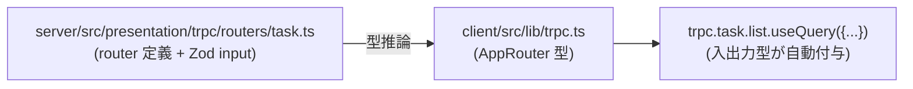

## 関連ファイル

- `server/src/presentation/trpc/init.ts`
- `server/src/presentation/trpc/routers/index.ts` (appRouter)
- `server/src/presentation/trpc/routers/*.ts` (12 ルーター)
- `server/src/presentation/handle-result.ts` (`Result<T, Fail>` → `TRPCError` 変換)
- `client/src/lib/trpc.ts`
- `client/src/main.tsx` (TRPCProvider / React Query 設定)

## 機能概要

クライアント・サーバー間の API プロトコルは **tRPC (v11)** で統一されている。
REST / GraphQL は採用していない。Query / Mutation / Subscription の 3 種類を
同一の型伝播機構で提供し、クライアントは `trpc.<domain>.<procedure>.useQuery()` /
`useMutation()` / `useSubscription()` で呼ぶ。

型の流れ:

## 設計意図

- **型重複のゼロ化**: OpenAPI / GraphQL スキーマの二重定義を避ける。
  Router の `z.object({...})` が Zod バリデーションと入力型の唯一の源泉
- **リファクタ安全**: Router の名前・パラメータ変更が client 側の型エラーに直結するので、
  壊れたまま動く余地がない
- **Query/Mutation/Subscription を同じ道具で**: WebSocket ベースの Subscription が
  同じ API で書けるので、ログストリーム / 承認フロー通知の実装が軽い
- **React Query 統合**: キャッシュ / 楽観的更新 / stale 再取得が組み込み。
  UI 層でキャッシュを独自管理する必要がない

`Result<T, Fail>` → `TRPCError` 変換は **Presentation 層の `handleResult()`** が単独で担う
（Usecase 層は例外を投げない、fail を返すだけ）。これにより tRPC エラーハンドリング規約と
Usecase のビジネスルールエラーが疎結合に保たれる。

## 検討された代替案

- **REST API + OpenAPI**: 標準的で他言語から呼べる。が、AutoKanban は**自分の client しか
  呼ばない**ので他言語互換性の価値が薄く、スキーマの二重定義コストだけが残る
- **GraphQL**: 柔軟なクエリと Subscription を備えるが、個人利用のこの規模では
  over-engineering。N+1 問題対策の DataLoader も本アプリには不要

## 主要メンバー

- ルーター: `appRouter` は 12 の sub-router（project / task / workspace / execution / ... ）
  を合成
- プロシージャ: `publicProcedure.input(Zod).query/mutation/subscription()`
- エラー規約: `handleResult(Result<T, Fail>)` が `TRPCError` に変換

## 関連する動作

- [typescript_is_the_single_language_across_stack](./typescript_is_the_single_language_across_stack.md) — 型共有の前提
- [usecase_is_executed_in_6_steps](./usecase_is_executed_in_6_steps.md) — tRPC から Usecase を呼び出す経路
- 各ドメインのルーターカード（例: `projects_are_listed`, `task_is_created_in_todo` 等）
