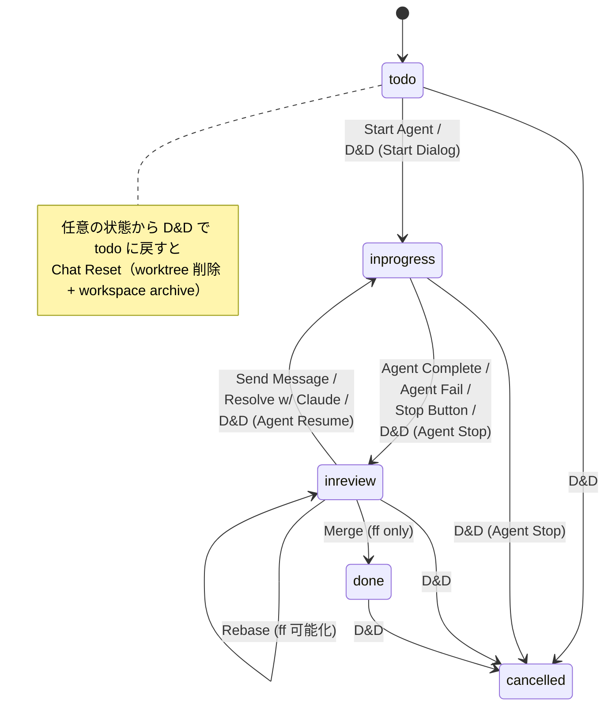

## 関連ファイル

- `client/src/components/project/KanbanBoard.tsx`
- `client/src/components/project/KanbanCard.tsx`
- `client/src/components/chat/StartAgentDialog.tsx`
- `server/src/models/task/index.ts` (`needsChatReset`, `toInReview`, `toDone`, `restoreFromInReview`)
- `server/src/usecases/task/update-task.ts`
- `server/src/usecases/execution/start-execution.ts`
- `server/src/usecases/execution/stop-execution.ts`
- `server/src/usecases/execution/queue-message.ts` (Agent Resume 経路)

## 機能概要

Task のステータス遷移は **3 つの経路**で発生する。

1. **システム自動遷移**（Executor callback が発火）
2. **UI アクション遷移**（画面内のボタン操作）
3. **カンバン D&D 遷移**（ドラッグ＆ドロップで任意ペアの遷移）

任意遷移は許可するが、**遷移方向ごとに副作用（Agent Stop / Chat Reset / Agent Resume）と
確認ダイアログが決まる**。このカードは全 5×5 マトリクスと UI ダイアログ規約の single source of truth。

## 状態

| ステータス | 説明 | UI 表示 |
|---|---|---|
| `todo` | 未着手 | 空のチャット、「Start Agent」ボタン |
| `inprogress` | 作業中 | 「Running」+ Stop ボタン、チャット有効 |
| `inreview` | レビュー待ち | 「Completed」、Stop なし、追加指示用入力可 |
| `done` | 完了（マージ済） | 読み取り専用 |
| `cancelled` | キャンセル | 終了状態 |

## システム自動遷移

| イベント | 遷移 | 由来 |
|---|---|---|
| Agent 正常終了 | `inprogress → inreview` | `on-process-complete` callback |
| Agent 異常終了 | `inprogress → inreview` | `on-process-complete` callback（exit != 0 でもレビューに回す） |
| Approval request 受信 | `inprogress → inreview` | `on-approval-request` callback（応答後 restore） |

> **設計判断**: Agent 失敗時も inreview にする。プロセスは既に停止しており、inprogress のままだと
> カンバン上で「進行中と誤認」する。inreview に置くことで「人間の確認待ち」として可視化する。

## UI アクション遷移

| アクション | 画面 | 遷移 |
|---|---|---|
| Start Agent | TodoView の「Start Agent」 | `todo → inprogress` |
| Stop | ChatHeader の「Stop」 | `inprogress → inreview` |
| Send Message | InReview のチャット入力 | `inreview → inprogress` |
| Merge (fast-forward) | InReview TopBar の「Merge」 | `inreview → done` |
| Rebase 成功 | InReview TopBar の「Rebase」 | `inreview → inreview` (ff 可能になる) |
| Resolve with Claude | Rebase Conflict Dialog | `inreview → inprogress` |
| Approval 応答 | ApprovalCard | `inreview → inprogress` (`Task.restoreFromInReview`) |

## カンバン D&D 全遷移マトリクス

**5×5 = 20 通りの D&D 遷移すべてを許可**（`Task.canTransition` は常に `true`）。
遷移方向ごとに副作用と確認ダイアログを決める。

### → todo（Chat Reset）

すべて Chat Reset を伴う（`Task.needsChatReset` が真）。
worktree 削除 + workspace archive（ブランチは保持）。

| 遷移元 | 副作用 | 確認ダイアログ |
|---|---|---|
| `inprogress → todo` | Agent Stop + Chat Reset | 「進行中の作業をリセットしますか？Agent が停止し、チャット履歴が削除されます」 |
| `inreview → todo` | Chat Reset | 「チャット履歴をリセットして初期状態に戻しますか？」 |
| `done → todo` | Chat Reset | 「完了したタスクを初期状態に戻しますか？チャット履歴が削除されます」 |
| `cancelled → todo` | Chat Reset | 「キャンセルしたタスクを復活させますか？チャット履歴が削除されます」 |

### → inprogress（Agent 起動または Resume）

| 遷移元 | 副作用 | ダイアログ |
|---|---|---|
| `todo → inprogress` | 選択 | StartAgentDialog（「Agent 実行開始」/「Agent なしで手動」） |
| `inreview → inprogress`（Agent 使用） | Agent Resume | メッセージ入力（次指示を送信） |
| `inreview → inprogress`（手動タスク） | ステータスのみ | なし |
| `done → inprogress` | 選択 | StartAgentDialog |
| `cancelled → inprogress` | 選択 | StartAgentDialog |

### → inreview

| 遷移元 | 副作用 | ダイアログ |
|---|---|---|
| `todo → inreview` | なし | なし |
| `inprogress → inreview` | Agent Stop | 「Agent を停止してレビュー状態にしますか？」 |
| `done → inreview` | なし | なし |
| `cancelled → inreview` | なし | なし |

### → done

| 遷移元 | 副作用 | ダイアログ |
|---|---|---|
| `todo → done` | なし | なし |
| `inprogress → done` | Agent Stop | 「Agent を停止して完了にしますか？」 |
| `inreview → done` | なし（Merge 後に自動） | — |
| `cancelled → done` | なし | なし |

### → cancelled

| 遷移元 | 副作用 | ダイアログ |
|---|---|---|
| `todo → cancelled` | なし | なし |
| `inprogress → cancelled` | Agent Stop | 「Agent を停止してキャンセルしますか？」 |
| `inreview → cancelled` | なし | なし |
| `done → cancelled` | なし | なし |

## 副作用パターン

### Agent Stop

Executor プロセスが running の場合に停止する。`inprogress` から任意遷移するときに発火。
実装は `stop-execution.ts` + `executor.stop(processId)`。

### Chat Reset

チャット履歴（session 配下の CodingAgentProcess / CodingAgentTurn / 会話ログ）と
workspace を archive。worktree を物理削除する（ブランチは保持）。
`todo` への遷移時のみ。`Task.needsChatReset(from, to)` が唯一の真実の源。

### Agent Resume

前回の `agentSessionId` / `agentMessageId` を使って続きから Agent を再起動。
`inreview → inprogress` で対象タスクが Agent 使用タスクの場合に発火。
実装は `queue-message.ts` の resume 分岐（[`execution_resumes_from_killed_session`](../execution/execution_resumes_from_killed_session.md)）。

## Merge ワークフロー (fast-forward only)

InReview TopBar には「Merge」と「Rebase」の 2 ボタン。**Merge は fast-forward only**。

| state | Merge ボタン | Rebase ボタン |
|---|---|---|
| ff 可能 | 有効（Secondary） | 通常（Secondary） |
| ff 不可 | 無効（opacity 0.4, tooltip「Fast-forward not possible. Rebase first.」） | 強調（アクセントカラー、Primary） |

フロー:

1. ff 可能 → Merge で `inreview → done`
2. ff 不可 → Rebase を要求
   - conflict なし → Rebase 成功、ff 可能に
   - conflict あり → Rebase Conflict Dialog
     - Cancel → inreview に留まる
     - Resolve with Claude → Agent 再起動（`inreview → inprogress`）

> **設計判断**: fast-forward only ルールにより main の履歴が常に線形に保たれる。
> ベースが先行していたら rebase を強制することで conflict の早期解消を促す。

## 確認ダイアログの原則

- **破壊的操作（Agent Stop / Chat Reset）を伴う遷移では必ず表示**
- **副作用のない純粋なステータス変更では表示しない**
- **UI ボタン操作はボタン押下自体が意図表明なので追加確認は最小限**

## コード上の遷移定義

```ts
// server/src/models/task/index.ts
const transitions: Record<Status, Status[]> = {
  todo:       ["inprogress", "inreview", "done", "cancelled"],
  inprogress: ["todo", "inreview", "done", "cancelled"],
  inreview:   ["todo", "inprogress", "done", "cancelled"],
  done:       ["todo", "inprogress", "inreview", "cancelled"],
  cancelled:  ["todo", "inprogress", "inreview", "done"],
};
```

**全遷移が許可される**。遷移の妥当性チェックより、副作用の適切な実行と確認ダイアログの
表示がアプリケーション層の責務。

## 状態遷移図

主要フローのみ図示。実際は全 5×5 遷移がカンバン D&D で可能。



## 関連する動作

- 概念: [task_is_a_unit_of_work_delegated_to_ai](../task/task_is_a_unit_of_work_delegated_to_ai.md)
- 遷移 4 種: `task_transitions_to_*` カード群
- UI: [kanban_board_renders_tasks_by_status](./kanban_board_renders_tasks_by_status.md)
- Rebase / Merge: [branch_is_rebased_merged_or_pushed](../git/branch_is_rebased_merged_or_pushed.md)
- Approval: [approval_request_is_detected_and_persisted](../callback/approval_request_is_detected_and_persisted.md)
